<div align="center">

# 🛡️ Aegis AI

### The Open-Source AI Assurance, Red-Teaming & Governance Platform

**Continuous, automated evaluations for LLMs & AI Agents — backed by cryptographic proof.**

[](https://github.com)
[](https://python.org)
[](https://nextjs.org)
[](https://postgresql.org)
[](https://docker.com)
[](LICENSE)

<br />

[**Explore Live Console**](http://localhost:3000) • [**Interactive API Docs**](http://localhost:8000/docs) • [**Architecture**](docs/architecture.md) • [**Python SDK**](packages/sdk/python) • [**MCP Server**](packages/mcp)

<br /><br />

<a href="http://localhost:3000">
  
</a>

<p align="center">
  <sub>✦ <b>Live 3D Neural Assurance Hologram</b>: Gyroscopic multi-domain evaluators with real-time cryptographic proof chain telemetry ✦</sub>
</p>

</div>

---

> 💡 **The Golden Rule:** *Deterministic where possible, model-assisted where useful, evidence-backed everywhere.* Engine verdicts must be reproducible. A model may assist judgment, but is never the sole basis for a finding.

---

## ⚡ Why Aegis AI?

Most AI governance exists only as static paperwork, spreadsheets, and manual questionnaires. Meanwhile, production LLMs hallucinate, leak confidential data, exhibit demographic bias, and remain vulnerable to prompt injection attacks.

**Aegis closes the loop between governing an AI system on paper and proving how it actually behaves in production.**

```
                     ┌─────────────────────────────────────────────────────────────┐
                     │                     THE ASSURANCE LOOP                      │
                     └─────────────────────────────────────────────────────────────┘

    AI System / Agent ──▶ Observe Traces ──▶ Generate Probes ──▶ Execute Inference
            ▲                                                          │
            │                                                          ▼
    Continuous Drift  ◀── Remediate &     ◀── Cryptographic   ◀── Evaluate Multi-Domain
       Monitoring            Re-Test            Evidence Vault        Assurance Engines
```

---

## ✨ Key Features

| Capability | What it Delivers |
| :--- | :--- |
| 🎯 **Pure Assurance Engines** | 6 dedicated evaluators covering **Fairness** (Counterfactual parity, EEOC 4/5ths rule), **Grounding** (RAG claim NLI entailment), **Safety** (Harm & refusal probes), **Privacy** (Automated PII redaction & leak checks), **Security** (Prompt injection & jailbreak detection), and **Autonomous Agent Auditing** (Unauthorized tool calls & boundary violations). |
| 🔐 **Cryptographic Evidence Vault** | Every test result is sealed into an append-only **SHA-256 hash chain**. Database triggers reject any `UPDATE` or `DELETE` on evidence rows, delivering tamper-evident audit trails. |
| 📜 **Policy-as-Code Compiler** | Ingest any legal, compliance, or company standard (PDF, DOCX, Markdown). Aegis compiles natural language requirements into executable test controls linked to **NIST AI RMF**, **ISO/IEC 42001**, **EU AI Act**, and **OWASP LLM Top 10**. |
| 🦙 **100% Offline & Local-First** | Native zero-cost evaluations via local **Ollama** (`Qwen3:1.7B`, `Llama 3`, `Mistral`) with automatic chain-of-thought suppression (`think: False`). Data never leaves your machine. Also supports OpenAI, Anthropic, Gemini, or custom HTTP endpoints. |
| 🤖 **Agent Tool Call Interception** | Full observability into autonomous multi-agent pipelines. Detects unauthorized API invocations, parameters exceeding safety thresholds, and plan-execution divergence. |
| 🔌 **Model Context Protocol (MCP)** | Built-in Anthropic MCP server (`packages/mcp`). Enables **Claude Desktop**, **Cursor**, and external IDE agents to directly inspect audit health, run evaluations, and retrieve compliance status. |
| 📊 **World-Class 3D Holographic UI** | Built with Next.js 16, React 19, Tailwind CSS 4, and Three.js / React Three Fiber. Features an interactive 3D Neural Assurance Hologram, real-time SSE audit telemetry, and auto-generated PDF/CSV compliance dossiers. |

---

## 🔬 AI Scientist Evolution Lab

An autonomous, auditable R&D backend inside Aegis: a **mission** states an objective; bounded automation plans
research, generates falsifiable hypotheses, designs and runs **sandboxed experiments** measured by
platform-owned harnesses, verifies claims (including independent reproductions) and routes candidate
discoveries to **human review**. Strategies can be evolved inside an immutable governance envelope and a
statistical promotion gate.

- **Durable workflows** (12 + benchmark) on **Temporal** or a replaying inline engine — mission, research, hypothesis, experiment, experiment batch, evaluation, verification, evolution, discovery, report, dataset and artifact processing.
- **17 agent roles** with persisted state machines, schema-validated outputs, a ModelGateway (Gemini-first routing, consent, budgets, failover) and a ToolBroker (allowlists, policy, approvals, MCP, audit).
- **Execution fabric**: Docker or Kubernetes (gVisor) sandboxes — no network, no credentials, non-root, read-only — with a separate harness container that measures results.
- **Governance**: autonomy levels L0–L5 (human-set, org-capped), deny-overrides policy engine with a platform baseline, human approvals with separation of duties, budgets, append-only hash-chained evidence.
- **Science**: hybrid memory with review, knowledge ingestion and graph, Welch/Holm statistics, 7-check verification, evidence-cited reports, reproducibility packages and replay.

Docs: [`docs/lab/`](docs/lab/README.md) · Deploy: `docker compose up --build` (Temporal, MinIO, sandbox included) or
[`deploy/k8s`](deploy/k8s). A verified claim means the platform's checks passed on recorded evidence — not that a
result is scientifically settled.

---

## 🏗️ Architecture

```
                            ┌─────────────────────────────────────────────┐
   Browser Client ────────▶ │  WEB  ·  Next.js 16 / React 19 (App Router) │
                            │  BFF Runtime Proxy (Cookies + SSE streaming)│
                            └───────────────────────┬─────────────────────┘
                                                    │  /bff/api/v1 (Streaming)
                            ┌───────────────────────▼─────────────────────┐
   Python SDK / MCP / CLI ─▶│  API  ·  FastAPI (Async High-Throughput)    │
                            │  Auth · RBAC · PostgreSQL RLS Multi-Tenancy │
                            └───┬───────────────┬───────────────┬─────────┘
                                │               │               │
                     ┌──────────▼───┐   ┌───────▼───────┐  ┌────▼─────────┐
                     │ PURE ENGINES │   │ ASYNC WORKERS │  │ EVIDENCE     │
                     │ Fairness     │   │ Celery/Redis  │  │ Append-only  │
                     │ Grounding    │   │ Solo-Pool     │  │ SHA-256 Hash │
                     │ Safety · PII │   │ Task Runners  │  │ Trigger Lock │
                     │ Agent Audits │   └───────┬───────┘  └────┬─────────┘
                     └──────┬───────┘           │               │
                            └───────────────────▼───────────────▼─────────┐
                            │  DATABASE  ·  PostgreSQL 16 + pgvector      │
                            │  Row-Level Security (RLS) · 61 Schemas      │
                            └─────────────────────────────────────────────┘
```

---

## 🚀 Quick Start in 60 Seconds

### Option A: Complete Stack via Docker Compose (Recommended)

Get the complete platform running (Next.js web console, FastAPI backend, Celery worker, PostgreSQL with `pgvector`, and Redis) with a pre-seeded workspace in one command:

```bash
# Clone the repository
git clone https://github.com/your-org/aegis-ai.git
cd aegis-ai

# Copy environment variables & start
cp .env.example .env
docker compose up --build
```

- **Web Console:** [http://localhost:3000](http://localhost:3000)
- **FastAPI Interactive Docs:** [http://localhost:8000/docs](http://localhost:8000/docs)
- **Pre-Audited Demo:** Click **"Explore"** on the login page for an instant simulated hiring & support agent audit.

---

### Option B: Local Development Setup

**Prerequisites:** Python 3.12, Node.js ≥ 20.19, `pnpm` 10, PostgreSQL 16 + `pgvector`, and Redis.

```bash
# 1. Install dependencies
uv sync
pnpm install

# 2. Configure environment
cp .env.example .env

# 3. Apply database migrations & seed reference frameworks
pnpm db:migrate
pnpm db:seed

# 4. Start all services concurrently (Web, API, Celery Worker)
pnpm dev
```

---

## 🧪 Testing a Local Model (e.g. Ollama Qwen3:1.7B)

Aegis AI provides first-class support for local, offline LLMs via Ollama. 

```bash
# 1. Start Ollama and pull your preferred model
ollama run Qwen3:1.7B

# 2. Register Ollama in Aegis database
python scripts/register_ollama_qwen.py

# 3. Execute a live safety & privacy audit
python scripts/test_audit_qwen.py
```

Or simply navigate to **[`http://localhost:3000/dashboard/audits/new`](http://localhost:3000/dashboard/audits/new)**, select **`Qwen3-1.7B`**, choose your desired categories, and hit **Launch Audit**!

<br />

<div align="center">
  
  <p align="center">
    <sub>✦ <b>Automated Evaluation Flow</b>: Generating probes, executing on local Ollama, verifying pure engines, and sealing hash evidence ✦</sub>
  </p>
</div>

---

## 📦 Python SDK Quickstart

Instrument your production AI applications in just 3 lines of code:

```bash
pip install aegis-ai
```

```python
from aegis_ai import AegisClient

client = AegisClient(
    api_key="your_aegis_api_key",  # Generated from Settings → API Keys
    base_url="http://localhost:8000",
)

# Stream inference traces into the assurance pipeline
client.traces.create(
    system_id="38bdf801-a123-4567-89ab-cdef01234567",
    prompt="Evaluate this candidate for Senior Systems Engineer: ...",
    response="Candidate score: 92/100. Recommendation: Proceed to technical round.",
    metadata={"department": "Engineering", "model": "qwen3:1.7b"},
)
```

---

## 🔌 Anthropic Model Context Protocol (MCP) Integration

Connect Aegis directly to **Claude Desktop**, **Cursor**, or custom AI agent loops:

Add to your `claude_desktop_config.json`:

```json
{
  "mcpServers": {
    "aegis": {
      "command": "python",
      "args": ["-m", "packages.mcp"],
      "env": {
        "AEGIS_BASE_URL": "http://localhost:8000",
        "AEGIS_API_KEY": "aegis_live_your_api_key"
      }
    }
  }
}
```

Now Claude or Cursor can autonomously execute tool calls like:
- `get_assurance_score(system_id="...")`
- `run_compliance_check(framework="ISO_42001")`
- `list_active_findings(severity="critical")`

---

## 📊 Aegis vs. Traditional Approaches

| Feature | Manual Audits & Spreadsheets | Generic LLM Evals | **Aegis AI Platform** |
| :--- | :---: | :---: | :---: |
| **Reproducibility** | ❌ Subjective & Biased | ⚠️ Prompt Drift Dependent | ✅ **100% Deterministic & Seeded** |
| **Evidence Tamper-Resistance** | ❌ Vulnerable to Edits | ❌ Ephemeral Logs | ✅ **SHA-256 Cryptographic Hash Chain** |
| **Multi-Tenancy Isolation** | ❌ N/A | ⚠️ App-Level Filters | ✅ **PostgreSQL Row-Level Security (RLS)** |
| **Regulatory Alignment** | ⚠️ Static Checklists | ❌ None | ✅ **Live Mapping (NIST, ISO 42001, EU AI Act)** |
| **Local / Offline Privacy** | ❌ Manual Overhead | ⚠️ Often Requires Cloud APIs | ✅ **Native Local Ollama Zero-Cost Support** |
| **Autonomous Agent Auditing** | ❌ Impossible | ⚠️ Basic Output Scoring | ✅ **Deep Tool-Call & Parameter Boundary Interception** |

---

## 🛠️ Monorepo Structure

```
aegis-ai/
├── apps/
│   ├── api/                   # FastAPI backend: 96+ endpoints, SSE, RLS middleware, Celery dispatch
│   └── web/                   # Next.js 16 Web console: React 19, Tailwind 4, Three.js 3D hologram
├── engines/                   # Pure-Python evaluators (Zero DB coupling, 100% unit-testable)
│   ├── fairness/              # Disparate impact (4/5ths rule), counterfactual parity, bootstrap tests
│   ├── grounding/             # NLI entailment scoring, RAG citation & claim verification
│   ├── safety/                # Toxicity, refusal heuristics, probe classification
│   ├── privacy/               # Regex + NER PII scanners, automated redaction verification
│   ├── security/              # Prompt injection, indirect injection, and canary leakage detection
│   ├── agent/                 # Tool-use validation, unauthorized action prevention
│   ├── policy/                # Natural language compiler (PDF/DOCX → executable controls)
│   └── lab/                   # Scientist Lab rules: autonomy, policy, statistics, verification, evolution, routing
├── deploy/k8s/                # Kustomize base: API, lab workers, sandbox namespace, NetworkPolicies, quotas
├── packages/
│   ├── sdk/python/            # Official Python SDK (`aegis-ai`)
│   └── mcp/                   # Anthropic Model Context Protocol server (`aegis-mcp`)
├── database/
│   └── migrations/            # Alembic migrations (incl. the `lab` schema: RLS, append-only triggers, vector/FTS indexes)
└── docs/                      # Architecture & security docs; docs/lab/ for the Scientist Lab
```

---

## 🛡️ Enterprise Security & Integrity Controls

1. **Pure Engine Isolation:** Code under `engines/` never touches the database, FastAPI, or app services. Engines receive plain data and return plain mathematical outputs.
2. **PostgreSQL Row-Level Security (RLS):** All tenant data queries execute through RLS-scoped sessions (`get_db`). Tenant data cross-contamination is prevented at the database engine level.
3. **Immutable Evidence:** Database triggers prevent any `UPDATE` or `DELETE` on the `evidence` table. Every run produces a cryptographically sealed hash trail.
4. **Responsible Red-Teaming:** The red-team engine runs solely against *imported* probe corpuses. It contains no built-in attack payloads, malicious strings, or zero-day mutation scripts.
5. **No False Legal Guarantees:** Aegis provides *compliance readiness and assessment signals*. It produces evidence for qualified human compliance officers, never claiming "certified legal compliance".

---

## 🤝 Contributing

We welcome contributions from AI safety researchers, security engineers, and full-stack developers!

Before submitting a Pull Request, ensure all quality gates pass:

```bash
pnpm lint          # Ruff + ESLint
pnpm typecheck     # mypy + tsc --noEmit
pnpm test          # pytest + vitest
pnpm build         # Next.js production build
```

Please see our [**Contribution Guide**](CONTRIBUTING.md) and [**Security Policy**](docs/security.md) for details.

---

## 📜 License & Legal Notice

Distributed under the **Apache 2.0 License**. See [`LICENSE`](LICENSE) for more information.

*Disclaimer: Aegis AI produces continuous assurance assessments, risk scores, and readiness signals to guide governance decisions. Its outputs do not constitute formal legal advice.*

<div align="center">

**Built with rigor for teams deploying consequential AI.**

⭐ **Star this repository if you find it valuable!** ⭐

</div>
