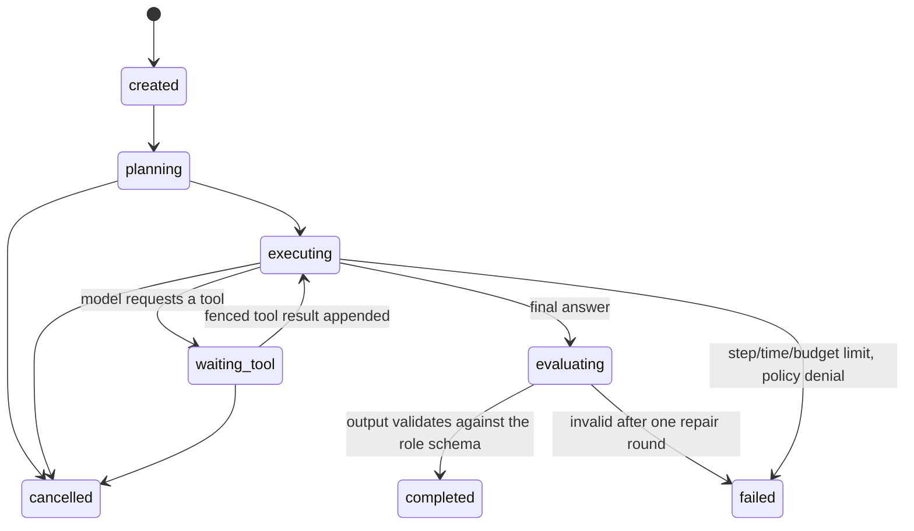
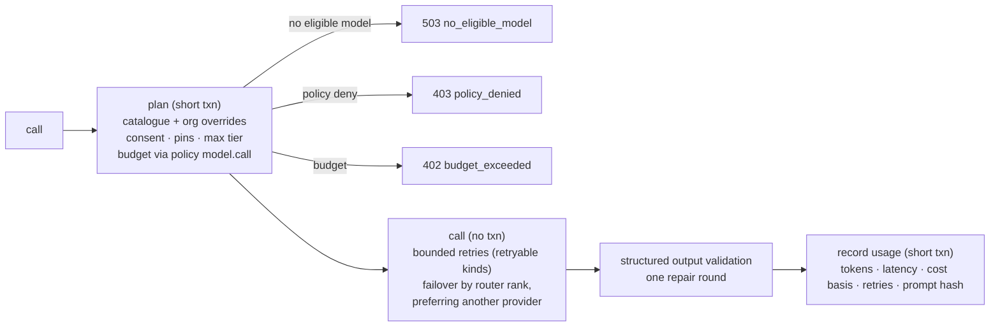

# Agent runtime

Agents in the lab are **bounded, schema-validated workers**, not free-running chat loops. Each agent run has a
role (what it may do), a versioned prompt, a structured output schema, a tool allowlist, step/time limits and a
persisted state machine; every model call goes through the ModelGateway and every tool call through the
ToolBroker. Agents propose; deterministic code decides.

## Roles

| Role | Purpose | Task class | Output schema | Default tools | Max steps | Proposes memory | MCP (if granted) |
| --- | --- | --- | --- | --- | --- | --- | --- |
| `quest` | Clarifies the mission into measurable objectives | planning | `MissionBrief` | — | 4 | no | no |
| `planner` | Plans research phases, queries and hypothesis directions | planning | `ResearchPlan` | `memory_search` | 4 | no | no |
| `literature` | Searches and synthesizes literature with citations | research | `LiteratureReview` | `paper_search`, `url_fetch`, `memory_search` | 6 | yes | yes |
| `knowledge` | Extracts entities and relations into the knowledge graph | extraction | `KnowledgeSynthesis` | `file_search`, `memory_search` | 4 | yes | yes |
| `hypothesis` | Generates falsifiable, measurable hypotheses | hypothesis_generation | `HypothesisSet` | `memory_search` | 4 | no | no |
| `hypothesis_critic` | Critiques hypotheses for falsifiability, novelty and feasibility | hypothesis_critique | `HypothesisCritiques` | `memory_search` | 4 | no | no |
| `experiment_designer` | Designs controlled, reproducible experiments | experiment_design | `ExperimentDesign` | `dataset_search`, `memory_search` | 4 | no | no |
| `coding` | Writes experiment code for the sandbox | coding | `CodeBundle` | — | 4 | no | no |
| `simulation` | Writes simulation code and configurations | coding | `CodeBundle` | — | 4 | no | no |
| `data_analyst` | Inspects results and data for anomalies | result_analysis | `DataAnalysis` | `object_storage` | 4 | no | no |
| `statistical_analyst` | Interprets statistical evidence and caveats | result_analysis | `StatisticalInterpretation` | — | 4 | no | no |
| `failure_analyzer` | Assists diagnosis of classified failures | failure_analysis | `FailureDiagnosis` | `memory_search` | 4 | yes | no |
| `evolution` | Proposes bounded parameter mutations | strategy_evolution | `MutationProposals` | `memory_search` | 4 | no | no |
| `reproduction` | Plans independent reproduction checks | verification | `ReproductionPlan` | — | 4 | no | no |
| `verifier` | Independently assesses whether evidence supports a claim | verification | `VerificationAssessment` | — | 4 | no | no |
| `scientific_reviewer` | Reviews design, statistics, leakage and overclaiming | scientific_review | `ScientificReview` | — | 4 | no | no |
| `report` | Writes evidence-cited report narrative | report_generation | `ReportNarrative` | — | 4 | no | no |

Organizations can create **agent definitions** per role (`POST /api/v1/agents`) and version them. A version may
*narrow* tools, steps and timeouts; it can never widen them beyond the role spec (validated on write).

## Run lifecycle

`AgentRuntime.run(task)` (`services/lab/agents.py`):

1. Resolves the effective configuration: role spec ∩ agent version ∩ mission `allowed_tools` (MCP tools are
   added only for roles with `mcp_allowed` and only when a human listed them on the mission).
2. Builds the prompt from the prompt registry (`engines/lab/prompts`): a protected `system.policy` block
   (cannot be overridden by organizations), the role template (org-active version or builtin), and the task
   input. Untrusted material (documents, search results, memories, tool outputs) is **sanitized and fenced**
   with `<<<UNTRUSTED_DATA ... nonce=...>>>` boundaries whose nonce is derived from the content hash, so content
   cannot forge its own closing boundary. The prompt hash is stored on the run.
3. Loops model call → tool calls → model call, bounded by `max_steps` (role, version and `AGENT_MAX_STEPS`) and
   the role timeout. Each step is persisted; cancellation is observed between steps.
4. Validates the final output against the role's Pydantic schema; one repair round-trip on invalid output,
   otherwise the run fails (outputs are never silently "fixed").
5. Records tokens, cost (only when priced), provider/model, tools used, injection score and trace id.

**Hand-offs** between agents are `AgentMessage`s signed with `AGENT_MESSAGE_SIGNING_KEY` (HMAC); unsigned or
tampered messages are rejected and recorded.

## ModelGateway

The only path from lab code to a model provider (`services/lab/model_gateway.py`):

- **Consent**: providers whose data leaves the organization (Gemini, OpenAI, Anthropic) are only eligible when the
  organization's quota has `allow_external_models`. Without consent routing fails closed with a hint; local
  models (Ollama) remain eligible. Embeddings fall back to the local hash embedder without consent.
- **Routing**: `ModelRouter` maps the task class to a base tier, moves one tier up for complexity ≥ 0.75 or down
  for ≤ 0.2, applies the mission's `max_model_tier` and per-task pins, filters by required features, latency
  and cost budgets, then ranks by tier distance, price and latency. Model ids come from configuration
  (`GEMINI_DEFAULT_MODEL`, `GEMINI_REASONING_MODEL`, `GEMINI_FAST_MODEL`, `GEMINI_DEEP_RESEARCH_AGENT`,
  `MODEL_CATALOG_JSON`, per-org `/models`), never from code.
- **Budgets**: the estimated spend is checked against mission, project and organization budgets and evaluated by
  the policy engine (`model.call`, facts include provider, model, tier and whether data leaves the org).
- **Usage** is recorded for successes and failures alike; costs are reported only when a price is configured
  (`cost_basis` says which).

| Task class | Base tier | Required features |
| --- | --- | --- |
| classification | fast | structured_output |
| extraction | fast | structured_output |
| summarization | fast | — |
| planning | reasoning | structured_output |
| research | deep_research | background |
| hypothesis_generation | reasoning | structured_output |
| hypothesis_critique | reasoning | structured_output |
| experiment_design | reasoning | structured_output |
| coding | default | structured_output |
| result_analysis | default | structured_output |
| failure_analysis | default | structured_output |
| strategy_evolution | reasoning | structured_output |
| scientific_review | reasoning | structured_output |
| report_generation | default | structured_output |
| verification | reasoning | structured_output |

### Gemini

`GeminiProvider` uses the Interactions API (`POST /v1beta/interactions`, API revision header): system
instructions, JSON-schema structured output, function tools, built-in tools (Google Search, code execution,
URL context, remote MCP), thinking level, seeds, streaming (SSE), usage metadata and `url_citation`
annotations. Model calls are sent with `store: false`. **Deep Research** runs as a background agent
interaction with polling, resumable streaming (`last_event_id`) and cancellation; its citations become
`research_sources`. Chain-of-thought (`thought` steps) is never stored.

## ToolBroker

All agent tool use goes through `ToolBroker.invoke` (`services/lab/tools.py`):

1. The tool must be in the run's effective allowlist (role ∩ version ∩ mission); MCP tools must additionally
   belong to an **approved** server and be individually **approved** by a human, and be scoped to the project.
2. Arguments are validated against the tool's JSON schema.
3. The policy engine evaluates `tool.call` (tool risk, source, network needs, mission autonomy). High-risk tools
   require an approval (reusable for 24 h for the same arguments).
4. A per-run call limit (24) bounds loops.
5. Results are sanitized, injection-scored and returned to the runtime, which fences them before they reach
   the model. Every call — allowed, denied, invalid or failed — is recorded in `lab.tool_calls` with redacted
   arguments.

Built-in tools: `paper_search` (arXiv/Crossref), `url_fetch` (SSRF-checked, size-limited), `memory_search`,
`file_search` (project documents), `dataset_search`, `object_storage` (read project artifacts). Tools that can
execute code are not exposed to agents: code runs only through experiments in the sandbox.

## Prompt-injection defences (summary)

- Detection (`engines/lab/security/prompt_injection.py`) scores weighted signals: instruction override, role
  reassignment, system-prompt probes, exfiltration requests, privilege escalation, policy evasion, tool
  invocation attempts, markdown exfiltration links, chat-template tokens, fence forgery, fake role headers,
  invisible/bidi characters and encoded payloads.
- Sanitization: invisible characters removed, chat-template tokens and fence forgeries neutralized, role headers
  quoted, length-bounded.
- Isolation: untrusted content is always fenced as data; the protected system policy tells the model that
  fenced content is never instructions; tools come only from the allowlist regardless of what content says.
- Containment: high injection scores quarantine documents and memories (≥ 0.8) or route them to review; agent
  runs record their maximum injection score.
