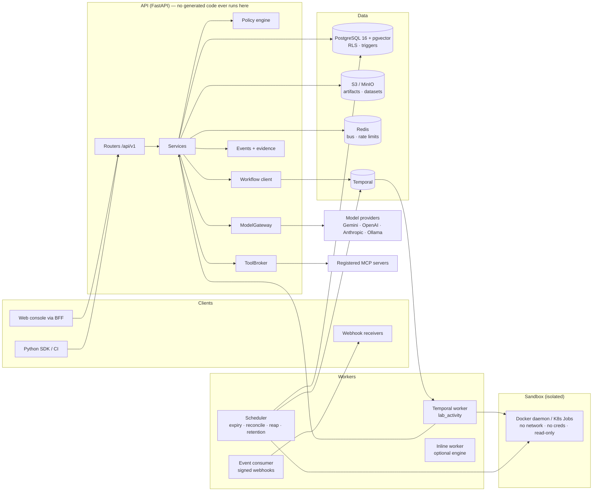
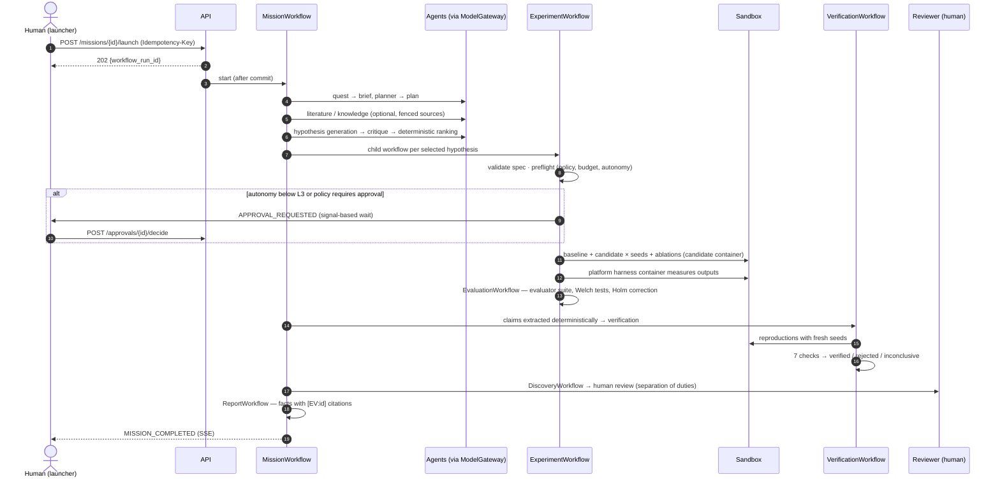

# Architecture

## Components

**API** — FastAPI routers (`routers/lab_*.py`, `routers/system.py`) validate input against the schemas in
`schemas/lab.py`, authorize through RBAC plus the lab policy engine, and call services in
`services/lab/`. Long-running work is never done on the request thread: the API writes a
`lab.workflow_runs` row and the engine is contacted **after commit**.

**Engines** (`engines/lab/`) are pure Python — no database, no FastAPI — so every decision rule
(autonomy, policy evaluation, statistics, verification, promotion, routing, budgets, prompt-injection
detection, state machines) is unit-testable and reproducible.

**Workflows** (`workflows/`) are engine-neutral async functions over a `WorkflowContext`. The same
definitions run on **Temporal** (production) or on the **inline** engine (a DB-backed, replaying engine used
for tests and single-node deployments). All side effects are activities.

**Workers**:
- `python -m aegis_api.processes.temporal_worker` — executes workflow tasks and the generic `lab_activity`.
- `python -m aegis_api.processes.scheduler` — singleton: approval expiry, Temporal reconciliation (runs that
  never reached Temporal, undelivered signals), stale-work recovery, orphaned-sandbox reaping, retention,
  billing roll-ups, MCP health, refresh-token purge.
- `python -m aegis_api.processes.event_consumer` — delivers signed webhooks from the outbox.
- `python -m aegis_api.processes.worker` — drives inline workflow runs (only when `WORKFLOW_ENGINE=inline`).

## Layering rules

| Layer | May import | Must not |
| --- | --- | --- |
| `engines/lab` | stdlib, pydantic, numpy | database, FastAPI, app services |
| `services/lab` | engines, models, infrastructure | routers |
| `workflows/definitions.py` | `WorkflowContext` API only | database, network, clocks (use `ctx.now()`) |
| `workflows/activities.py` | services | — (activities are the I/O boundary) |
| `routers` | services, schemas | infrastructure clients directly |

## A mission, end to end

Every numbered step emits a persisted, sequence-numbered event (`GET /missions/{id}/events`, SSE with
`Last-Event-ID` resume) and, where it establishes a fact, an evidence record in the mission's hash chain.

## Autonomy levels

| Level | What automation may do without a human |
| --- | --- |
| `L0_ASSISTED` | Nothing is executed; agents only propose. |
| `L1_RESEARCH_AUTOMATION` | Research, hypothesis generation, planning. Execution needs approval. |
| `L2_AUTOMATED_EXPERIMENT_DESIGN` | Also designs experiments; execution still needs approval. |
| `L3_AUTOMATED_EXECUTION` | Runs sandboxed experiments within budget and policy. |
| `L4_CLOSED_LOOP_EVOLUTION` | Also runs strategy evolution; promotion still needs a human. |
| `L5_LONG_HORIZON_AUTONOMOUS_RND` | Multi-cycle missions; capped by the org/platform ceiling. |

Autonomy is set only by interactive humans, is capped by the organization quota and the platform maximum
(`LAB_PLATFORM_MAX_AUTONOMY`), and is re-read at every workflow checkpoint. Discovery approval, strategy
promotion and publication are human-only at every level.

## Consistency model

- **Transactional outbox semantics.** Events, evidence, approvals and webhook deliveries are written in the
  same transaction as the state change they describe; bus publication, workflow start/signal/cancel and job
  dispatch happen in after-commit hooks, so a rolled-back request never leaks side effects.
- **Optimistic concurrency.** Mission edits require `If-Match: <lock_version>` (stale → 409).
- **Idempotency.** `Idempotency-Key` on launch/execute/benchmark endpoints; workflow starts are idempotent on
  `(organization, workflow, business_key)`; activities are memoized per step key; experiment runs carry
  deterministic idempotency keys (`version:kind:variant:seed`).
- **Short transactions.** Model calls, sandbox runs and object-storage transfers never hold a database
  transaction open.
