# Domain model

All lab entities live in the `lab` PostgreSQL schema, carry `organization_id` (tenant) and, where they belong to a
project, `project_id`. Every status change goes through an explicit state machine
(`engines/lab/state_machines.py`, `<MACHINE>.ensure(current, target)`); transitions not listed below are
rejected. The diagrams in this document are generated from that code.

## Entity map

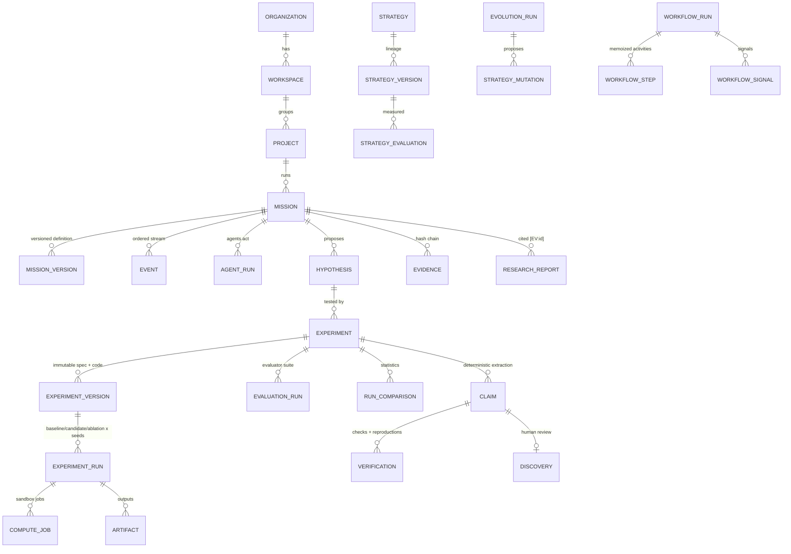

## Core concepts

| Concept | Meaning | Key invariants |
| --- | --- | --- |
| **Mission** | A research objective with constraints, success criteria, budgets, allowed tools, risk and autonomy level. | Definition edits only while `draft`/`planned`/`paused`/`failed`; every edit snapshots a `MissionVersion`; optimistic locking via `lock_version`. |
| **Hypothesis** | A falsifiable statement with a *measurable prediction* (`metric`, `direction`). | Citations to unknown sources are dropped; ranking is deterministic (critique 0.6, feasibility 0.25, confidence 0.15). |
| **Experiment / version** | Spec (IO contract, metrics, seeds, baselines, ablations, harness) + code bundle. | Versions are immutable; failed experiments are retried as a *new* version. |
| **Experiment run** | One sandboxed execution (baseline, candidate or ablation × seed). | Metrics come from the harness container; `self_reported` is recorded and never trusted for claims. |
| **Evaluation run** | The evaluator suite over all runs (`resource`, `metric`, `benchmark`, `statistical`). | Welch tests with Holm-adjusted p-values; results sealed as evidence. |
| **Claim** | A statement extracted deterministically from evaluations (or entered by a human). | Wording is bounded (no overclaiming terms); status only via verification. |
| **Verification** | Seven checks plus independent reproductions. | Model assessment is recorded but never decisive. |
| **Discovery** | A verified claim routed to human review. | Human-only approval, separation of duties, policy `discovery.approve`. |
| **Strategy / version** | A parameterised way of working plus an immutable governance envelope. | Versions may never widen governance; promotion needs the statistical gate and a human. |
| **Evidence** | Append-only, hash-chained records per mission (or project) scope. | Database triggers reject UPDATE/DELETE of recorded fields. |
| **Approval** | A human decision a workflow waits on (signal-based). | Human-only, permission per kind, separation of duties, TTL expiry. |

## Lifecycles

### Mission

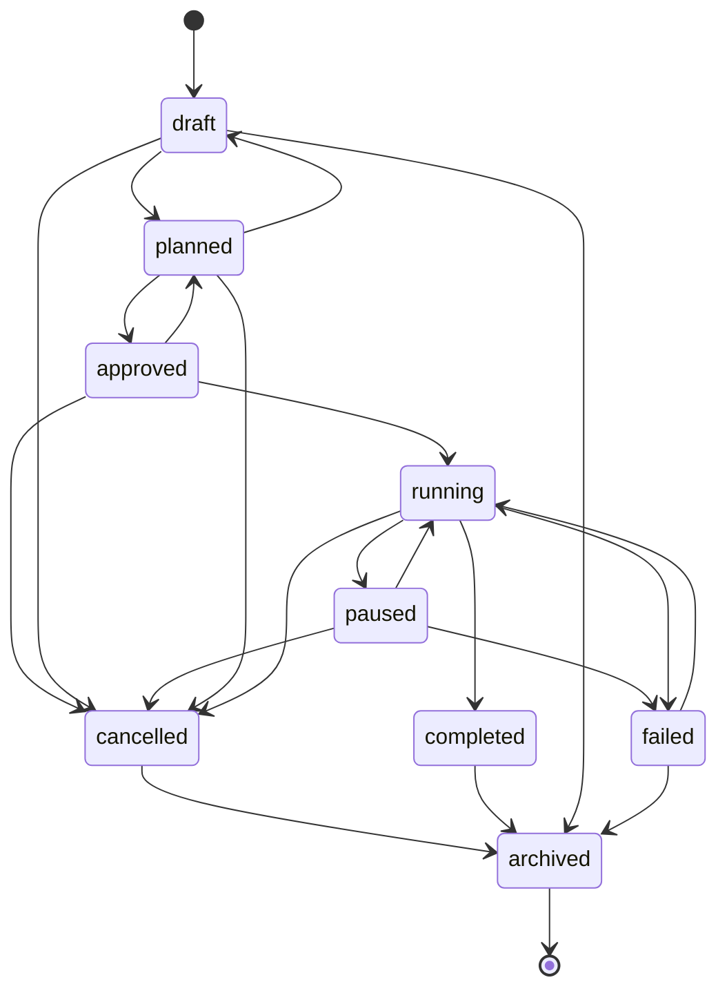

### Agent run

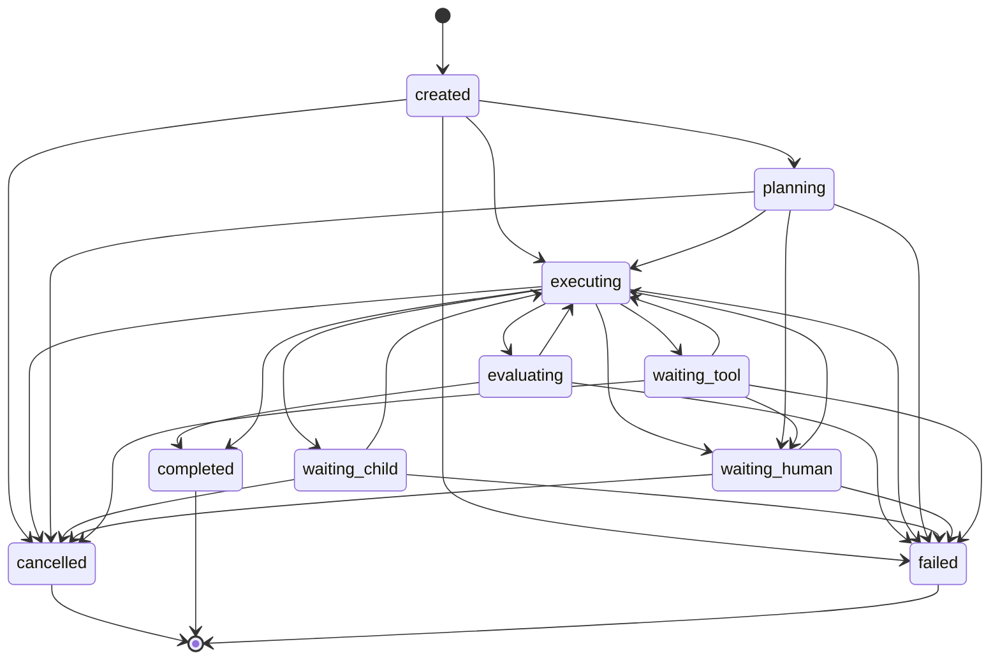

### Hypothesis

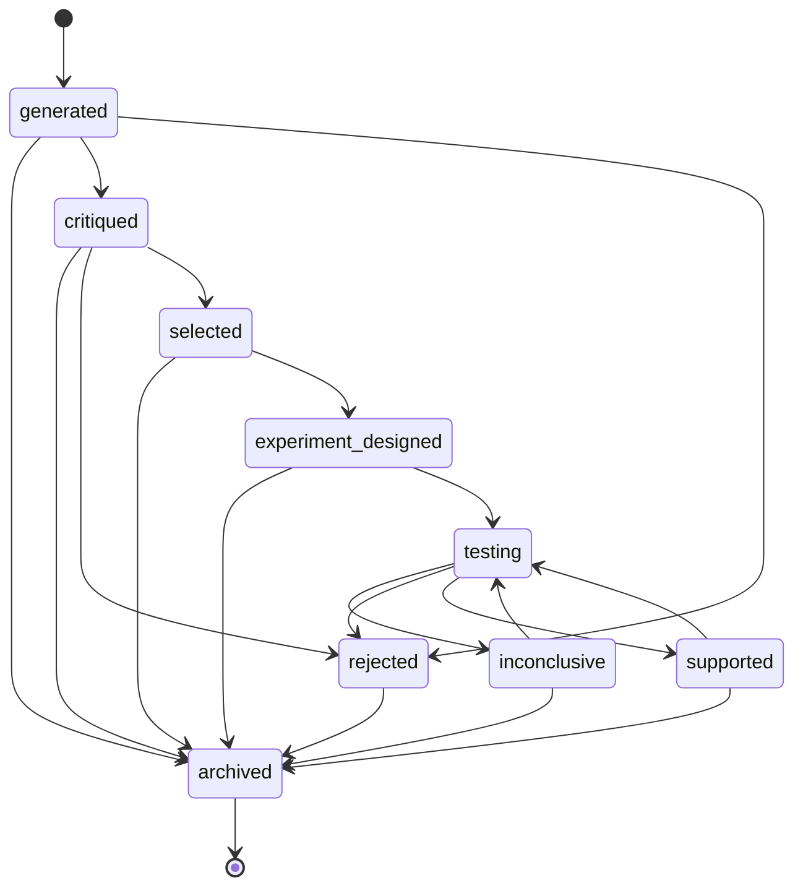

### Experiment

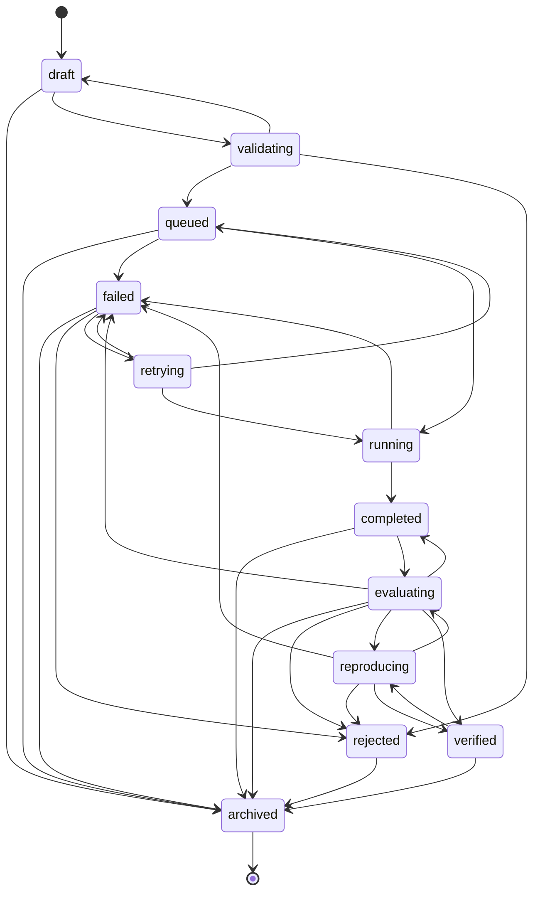

### Experiment run / compute job

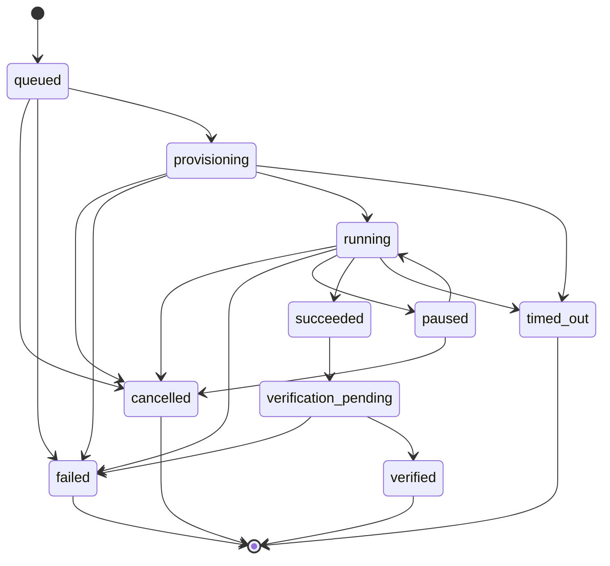

### Claim

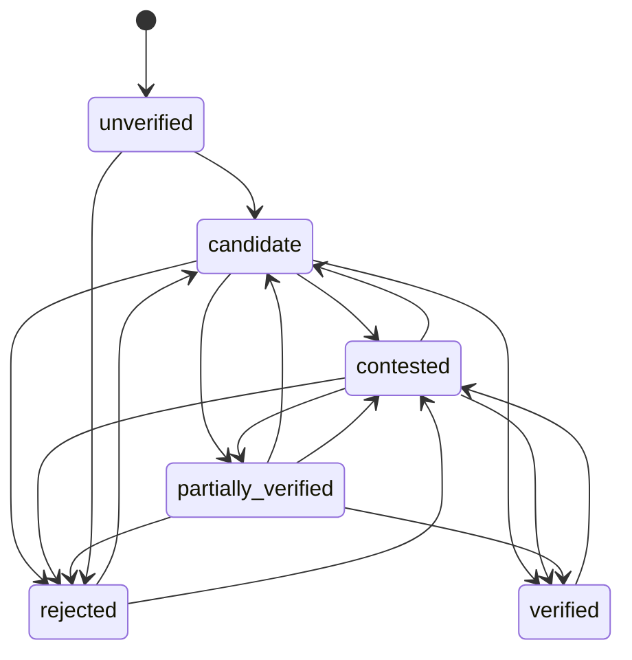

### Discovery

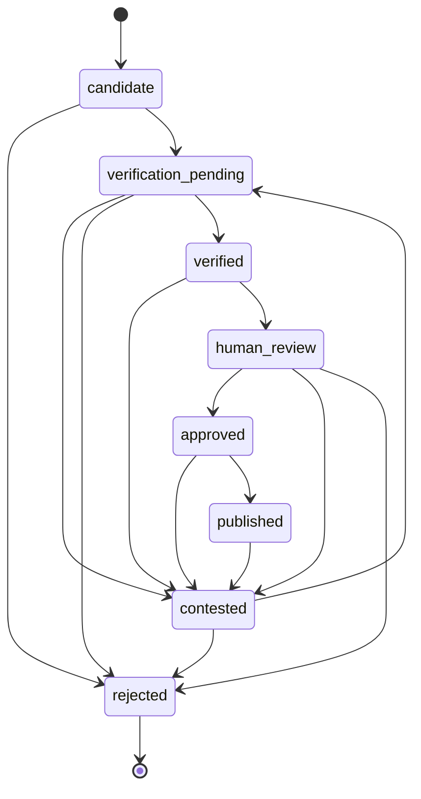

### Strategy

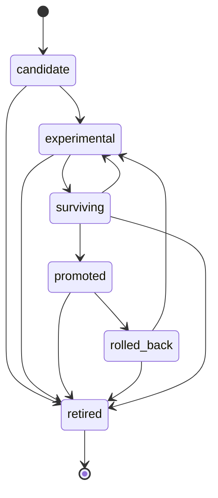

### Approval

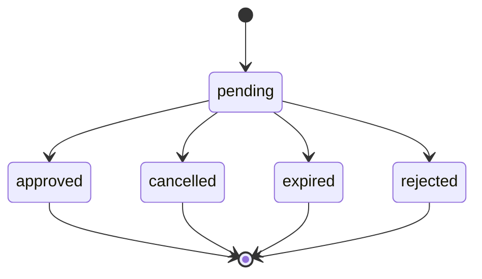

### Research task

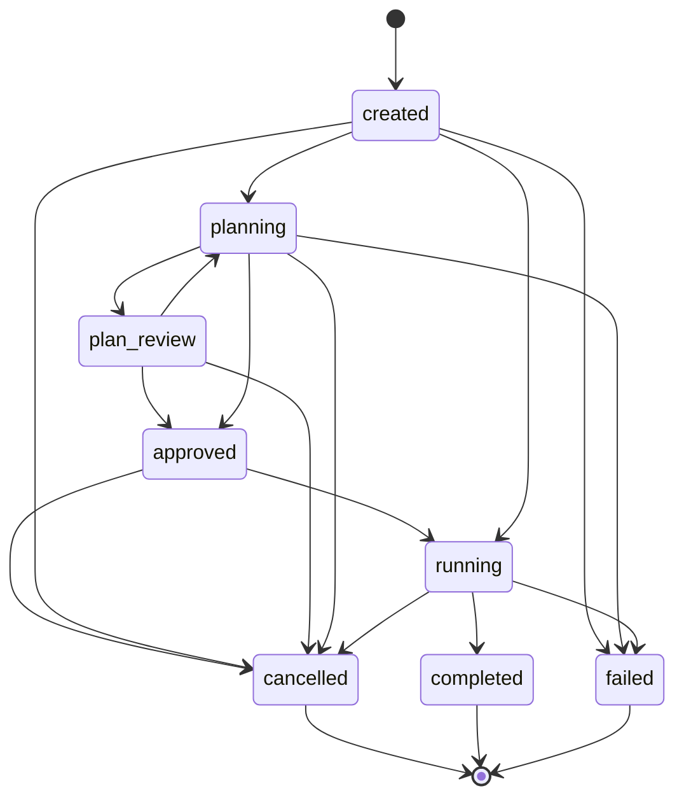
