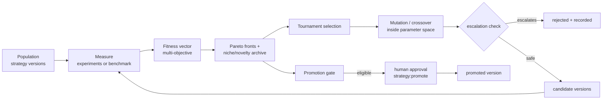

# Strategy registry and evolution

A **strategy** is a versioned, parameterised way of doing research work (for example the settings of an
optimiser, an analysis procedure, or an agent behaviour). Evolution proposes new versions from *measured*
results; promotion to "the version in use" is gated statistically, by policy, and by a human.

## Strategy definition

```json
{
  "kind": "optimization",
  "description": "[DEMO] Simulated-annealing settings",
  "parameter_space": [
    {"name": "step", "kind": "float", "low": 0.05, "high": 2.0},
    {"name": "temperature", "kind": "float", "low": 0.5, "high": 50.0, "log": true},
    {"name": "restarts", "kind": "int", "low": 1, "high": 10},
    {"name": "method", "kind": "categorical", "choices": ["anneal"], "mutable": false}
  ],
  "parameters": {"step": 0.5, "temperature": 10.0, "restarts": 4, "method": "anneal"},
  "behavior": {},
  "governance": {"tools": [], "network": "none", "secrets": [], "permissions": [],
                 "max_autonomy": "L3_AUTOMATED_EXECUTION", "model_tiers": ["fast", "default", "reasoning"],
                 "production_access": false}
}
```

Validation: parameters must lie in the declared space; `behavior.tool_sequence` may only use governance tools;
`behavior.model_tier` must be a governance tier; unknown fields are rejected.

## The governance envelope

`governance` is **immutable under evolution**. A new version (human-authored or evolved) is checked against its
parent with `check_escalation`; any of these is an escalation:

- new tools, network access (`none` → `allowlist`), new egress hosts, new secrets, new permissions;
- a higher autonomy ceiling, new model tiers, production access;
- a different strategy kind.

Escalations set the policy fact `strategy.governance_escalation`, which the baseline policy **denies**
(`403 policy_denied`) — for humans and automation alike. A human who genuinely needs broader capabilities
creates a new strategy, which goes through normal review.

## Evolution loop



- **Deterministic**: `EvolutionEngine` is seeded (`EvolutionConfig.seed`); given the same measurements it
  produces the same rankings and candidates. It never runs experiments or promotes anything itself.
- **Modes**: `experiment` — each candidate becomes a new version of a template experiment and runs through the
  normal sandbox + harness path; `benchmark` — candidates are scored on a platform benchmark function
  (sphere, Rastrigin, Rosenbrock, Ackley) for fast, cheap iteration.
- **Objectives** (default): performance (primary metric, required), cost, latency, compute, robustness (variance
  across seeds), reproducibility, novelty, safety. Missing measurements are never invented.
- **Configuration** (`EvolutionConfig`): population size, offspring per generation, mutation/crossover rates,
  tournament size, archive size, max generations, objectives, niche descriptors.
- Every mutation is stored (`strategy_mutations`) with the parameter changes and the reason; lineage is
  available at `GET /strategy-versions/{id}/lineage` and in the knowledge graph (`evolved_from`).

## Promotion gate

`PromotionGate.evaluate(candidate, incumbent)` (pure, `engines/lab/evolution/promotion.py`) requires:

| Check | Rule |
| --- | --- |
| `feasible` | no hard-constraint violations |
| `min_evaluations` | at least 3 measured evaluations |
| `reproduced` | an independent reproduction succeeded (when required) |
| `not_dominated` | the incumbent does not Pareto-dominate the candidate |
| `no_safety_regression` | safety objective not worse than the incumbent |
| `statistically_better` | Welch's t-test on the primary metric, p < 0.05, in the improving direction |
| `meets_min_improvement` | improvement ≥ the configured minimum (and > 0) |

Then the policy engine evaluates `strategy.promote`: below mission autonomy L4, and whenever the organization has
not explicitly enabled auto-promotion, promotion **requires human approval**; the endpoint
`POST /strategies/{id}/promote` is human-only (`strategy:promote`). A human may override a failing gate only
explicitly (`override_gate: true`), which is audited. Promotions take an advisory lock per strategy.

## Rollback

`POST /strategies/{id}/rollback` (`strategy:rollback`) restores the previously promoted version, recorded in the
version history and audit log. Nothing is deleted; versions are immutable.
