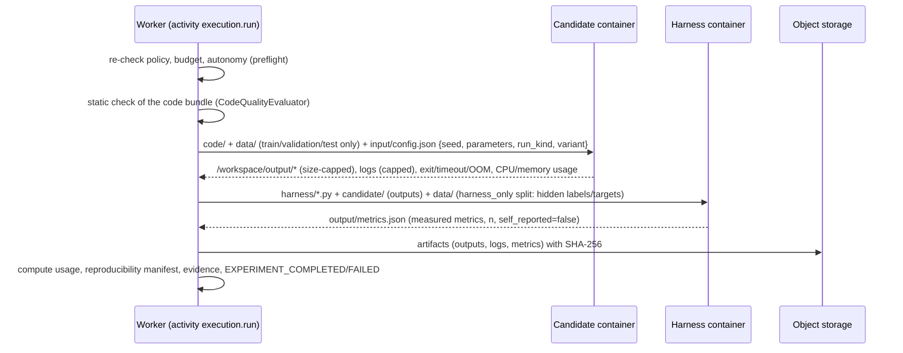

# Execution fabric

**Generated research code never runs inside the API or worker processes.** Every experiment run is executed
as sandboxed containers by an `ExecutionBackend` (`infrastructure/execution/`), and its results are measured
by a platform-owned harness in a *separate* container — the code under test never reports its own score.

## Two-container measurement

**Candidate contract** (`GET /api/v1/experiments/contract` returns it together with the spec JSON schema):

| Path | Meaning |
| --- | --- |
| `/workspace/code` | the experiment's code bundle; the entrypoint runs with `cwd=/workspace` |
| `/workspace/input/config.json` | `{seed, parameters, run_kind, variant}` |
| `/workspace/data/<path>` | dataset splits `train`/`validation`/`test` only — `harness_only` files (hidden labels) are never mounted |
| `/workspace/output/` | the only place outputs are collected from |

**Harnesses** (`engines/lab/harnesses`, stdlib-only scripts run in the same pinned image):

| Harness | Measures |
| --- | --- |
| `objective` | re-evaluates the candidate's reported solution on a platform-defined benchmark function (sphere, Rastrigin, Rosenbrock, Ackley) |
| `classification` | predictions vs hidden labels (accuracy, macro F1, ...) |
| `regression` | predictions vs hidden targets (RMSE, MAE, R²) |
| `self_reported` | only validates the candidate's `metrics.json`; results are flagged `self_reported=true` and can never satisfy verification |

## Isolation controls

| Control | Docker backend | Kubernetes backend |
| --- | --- | --- |
| Network | `network_mode=none` | NetworkPolicy deny-all (collector upload to object storage only); allowlisted egress requires an egress gateway |
| Identity | uid/gid 65534, no service-account token | uid/gid 65534, `automountServiceAccountToken: false`, `enableServiceLinks: false` |
| Privileges | `cap_drop=ALL`, `no-new-privileges` | capabilities dropped, `allowPrivilegeEscalation: false`, seccomp `RuntimeDefault`, Pod Security `restricted` |
| Filesystem | read-only root; `/tmp` tmpfs `noexec,nosuid` | read-only root; `emptyDir` workspace with size limit |
| Resources | CPU, memory, PIDs, wall-clock timeout, output/log byte caps | requests = limits (CPU, memory, ephemeral storage, optional GPU), `activeDeadlineSeconds`, namespace quota |
| Runtime | Docker (compose uses a separate TLS-protected dind daemon) | optional gVisor/Kata `runtimeClassName` |
| Environment | only `AEGIS_*`, `PYTHON*`, `OMP_/MKL_/OPENBLAS_*` variables; platform credentials are never inherited | same |
| Secrets | none unless a policy-approved secret request (approval kind `secret_access`) | same |
| Images | only images registered as execution environments; digest pinning enforceable (`EXECUTION_REQUIRE_DIGEST_PINNED_IMAGES`) | same |

Outputs are extracted with path-traversal and symlink protection; oversized outputs are truncated and flagged.
The scheduler reaps orphaned sandbox containers/jobs. These controls are exercised by
`tests/unit/lab/test_sandbox_docker.py` against a real Docker engine.

## Gating

Before any run, `execution.preflight` evaluates `experiment.execute` against the policy engine with facts about
the mission autonomy, requested resources, network and secrets, and the estimated compute cost against
mission/project/org budgets:

- **allow** — runs proceed;
- **approval_required** — an approval (`experiment_execution`, `expensive_compute`, `external_network` or
  `secret_access`) is created on the experiment version and the workflow waits for the human decision;
- **deny** — the experiment fails with the policy reasons.

`execute_run` re-checks the gate immediately before launching each job, so a revoked approval, a lowered
autonomy level or an exhausted budget takes effect mid-batch.

## Experiment plans

`plan_runs` creates, per experiment version: baseline and candidate runs for each seed (at least the spec's
`min_seeds`), plus ablations × 2 seeds. Each run has an idempotency key `version:kind:variant:seed`, so a
replayed activity never creates duplicate runs. Reproductions (verification) reuse the plan with seed offset
10007 so they never share seeds with the original runs.

## Compute accounting

Each job records wall-clock runtime, CPU seconds and peak memory as measured by the backend; cost is computed
only when `COMPUTE_PRICING_JSON` prices the resource class (otherwise it is reported as unpriced). Usage rolls
up to mission, project and organization budgets and to billing.
