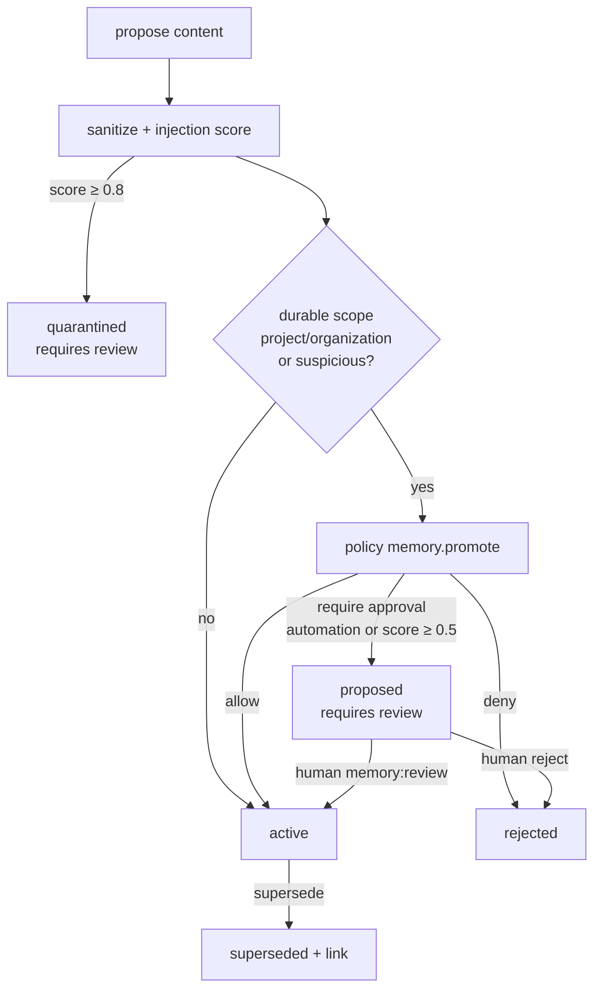

# Scientific memory and knowledge

The lab keeps three kinds of knowledge, each with a different trust model:

| Store | What goes in | Trust model |
| --- | --- | --- |
| **Documents** (`documents`, `document_versions`, `document_chunks`) | Uploaded files and fetched URLs | Untrusted data: scanned, parsed, injection-scored, chunked, embedded; always fenced when shown to agents |
| **Research sources** (`research_sources`) | Papers and pages found by literature search or Deep Research citations | Untrusted data with provenance (URL, DOI/arXiv id, retrieval time, checksum) |
| **Memory** (`memories`, `memory_links`) | Distilled statements: lessons, results, strategies, failures | Governed: scope, status, review, supersession, expiry |
| **Knowledge graph** (`graph_nodes`, `graph_edges`) | Typed links between everything above and missions, runs, claims | Structural; allowlisted node types and relations |

## Memory governance

- **Scopes**: `short_term` (expires), `mission`, `project`, `organization`. Project and organization scopes are
  durable.
- **Categories**: literature, experiment, failure, strategy, evidence, discovery, general.
- **No automatic promotion of agent output into durable memory**: memories proposed by automation (agents,
  workflows, API keys, service accounts) into durable scopes require a human `memory:review` decision; content
  with an injection score ≥ 0.8 is quarantined regardless of source. Human-authored memories are active
  immediately.
- **Deduplication**: identical content in the same scope/project/mission returns the existing memory.
- **Supersession** keeps history: the old memory is marked `superseded` and linked to its replacement.
- **Visibility**: memories inherit project visibility; agents only read the scopes their role allows
  (mission and project by default).

## Knowledge ingestion (ArtifactProcessingWorkflow)

1. **Acquire** — upload (`POST /knowledge/documents`, size-limited, streamed) or URL registration
   (`POST /knowledge/urls`; SSRF-validated up front and on every redirect hop; response size-limited).
2. **Scan** — executable content (PE, ELF, Mach-O and `#!` scripts, by magic bytes) is rejected; ClamAV
   scanning when configured (`MALWARE_SCANNER=clamav`), otherwise recorded as `not_scanned`.
3. **Parse** — PDF, Markdown, HTML, CSV (with a column profile), JSON and Jupyter notebooks; plain text
   otherwise. (Literature-search XML responses are parsed with `defusedxml`.)
4. **Injection score** — documents scoring ≥ 0.8 are quarantined (not chunked into search).
5. **Chunk** — ~1,200-character chunks with 150-character overlap and exact character offsets.
6. **Embed** — the configured embedding provider when the organization allows external models, otherwise the
   local deterministic hash embedder; the model id is stored with every vector.
7. **Graph** — document and extracted entities/concepts are linked in the knowledge graph.

## Search

`POST /api/v1/knowledge/search` (chunks) and `POST /api/v1/memory/search` (memories) are **hybrid**:
PostgreSQL full-text ranking and pgvector cosine similarity (HNSW) are fused with reciprocal-rank fusion.
Vectors are compared only when produced by the same embedding model. Results respect tenant, project
visibility, scope and status filters.

## Knowledge graph

Node types: `mission`, `paper`, `document`, `concept`, `method`, `dataset`, `entity`, `hypothesis`,
`experiment`, `run`, `result`, `metric`, `claim`, `evidence`, `failure`, `strategy`, `discovery`.

Relations: `cites`, `mentions`, `supports`, `contradicts`, `extends`, `uses`, `tests`, `part_of`,
`derived_from`, `generated_by`, `evaluated_by`, `verified_by`, `reproduces`, `evolved_from`,
`failed_because_of`.

Nodes are upserted on `(organization, type, key)` and edges are idempotent, so replayed activities never
duplicate the graph. `GET /graph/nodes` and `GET /graph/nodes/{id}/neighborhood` expose it; claim lineage
(`GET /claims/{id}/lineage`) is assembled from the same records.

## Failure intelligence and lessons

Failed runs are classified deterministically by rule (data, code, tool, model, experiment-design, evaluation,
statistical, hypothesis, resource, reproducibility, strategy or policy failure — with the matching rule, root
cause and evidence lines), matched against earlier failures for recurrence, optionally diagnosed by
the `failure_analyzer` agent (recorded next to, never instead of, the deterministic classification), and turned
into **lessons** that are proposed as project memories — subject to the governance above.
